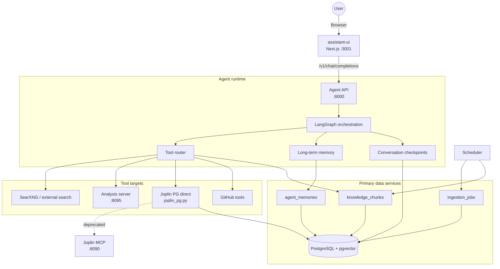

# Architecture

Parsnip is a local-first research and knowledge platform built around an
assistant-ui Next.js frontend, a FastAPI/LangGraph agent runtime, PostgreSQL
with pgvector, scheduled ingestion, and optional analysis/Joplin integrations.

## High-Level Topology



assistant-ui (Next.js) owns the browser experience. The Agent API owns
orchestration, retrieval, memory, tool execution, and model selection.
Joplin integration uses direct PostgreSQL access (joplin_pg.py) — the legacy
MCP HTTP bridge is deprecated (shown as dashed line above).

## Main Services

- `agent`: FastAPI service for retrieval, synthesis, memory, and tool workflows.
- `frontend`: assistant-ui Next.js app providing the chat UI, pointed at `/v1/chat/completions`.
- `pipelines`: OpenWebUI-compatible adapter that forwards chat traffic to the agent (legacy, retained for backward compatibility).
- `analysis`: optional execution service for Python/R workloads and generated artifacts.
- `scheduler`: recurring ingestion, Joplin sync safety jobs, and backup jobs. Auto-recovers stuck jobs on startup.
- `postgres`: primary store for vectors, memories, checkpoints, structured data, and Joplin's database.
- `joplin` / `joplin-mcp`: optional note server and integration bridge (MCP bridge deprecated; agent uses `joplin_pg.py` instead).
- `searxng`: local metasearch endpoint used when configured.

## Data Model Highlights

- `knowledge_chunks`: chunked source text, metadata, embeddings, and per-source identifiers.
- `agent_memories`: durable memory records used across sessions.
- `ingestion_jobs`: ingestion run state, progress, and resume tracking.
- LangGraph checkpoint tables: persisted conversation state.
- Structured tables such as `forex_rates` and `world_bank_data`.

## Ingestion Pattern

Ingestion pipelines follow a fetch/process split:

1. Fetch source payloads.
2. Persist raw landing artifacts where applicable.
3. Normalize, chunk, and embed records.
4. Upsert into structured/vector tables.
5. Record progress in `ingestion_jobs`.

This keeps source fetching separate from embedding and database writes, so failed
processing can be replayed without re-hitting upstream APIs.

## Model Routing and Backends

Concrete model IDs are deployment configuration, not code. The runtime resolves
stable aliases from `.env`:

- `FAST_MODEL`
- `SMART_MODEL`
- `REASONING_MODEL`
- `GRAPH_MODEL`
- `CLASSIFIER_MODEL`

Each alias can be a comma-separated fallback chain. `DEFAULT_LLM` and
`RESEARCH_LLM` may point at either explicit model IDs or aliases such as `smart`
and `reasoning`.

Supported backend modes:

- `LLM_PROVIDER=openrouter`: OpenRouter-hosted models.
- `LLM_PROVIDER=openai_compat`: any OpenAI-compatible endpoint.
- Ollama-compatible local/cloud endpoints through `OLLAMA_BASE_URL`,
  `OLLAMA_CLOUD_URL`, `OLLAMA_API_KEY`, and optional GPU routing variables.

Provider failover is explicit: sensitive workloads do not silently move to an
external provider unless that provider is configured in `.env`.

## Runtime Guardrails and Cost Control

- Adaptive tool budgets by complexity tier.
- Repeated-tool-call detection for identical arguments.
- Context pruning for oversized tool output and long message histories.
- LangGraph recursion caps to prevent runaway loops.
- Required model aliases validated at startup.

## Plugin Registry Architecture

Ingestion sources are managed declaratively via `ingestion/sources.yaml` and the
`SourceRegistry` class (`ingestion/registry.py`). The registry:

1. Reads explicit source definitions from `sources.yaml` (module, schedule, conflict strategy, embedding config).
2. Auto-discovers `ingest_*.py` files in the ingestion directory that are not declared in YAML.
3. Validates each module has a `main_async()` (preferred) or `main()` entry point.
4. Provides `list_sources(enabled_only=True)` and `get_source(name)` for the scheduler.

The scheduler consumes `SourceRegistry` via `scheduler/registry_adapter.py`, which
bridges scheduled jobs to the registry's source definitions. Adding a new source
only requires creating the script and adding an entry to `sources.yaml`.

## Connection Pool Architecture

The agent uses a named connection pool registry (`agent/tools/db_pool.py`) backed
by `psycopg_pool.AsyncConnectionPool`:

- **`agent_kb`**: primary pool for knowledge base, memory, and checkpoint access.
- **`joplin`**: dedicated pool for Joplin PostgreSQL database (direct PG access, no HTTP/MCP).

Pools are initialised at app startup (`lifespan` in `main.py`) and closed on shutdown.
Any tool can retrieve a pool by name:

```python
from tools.db_pool import get_pool
pool = get_pool("agent_kb")
async with pool.connection() as conn:
    await conn.execute("SELECT 1")
```

## Circuit Breaker

The agent implements a file-based circuit breaker for OpenRouter rate-limit and
quota errors (`agent/graph_guardrails.py`):

- **State file**: `/tmp/parsnip_circuit_breaker.json` (configurable via `PARSNIP_CIRCUIT_BREAKER_PATH`).
- **Trip conditions**: OpenRouter returns 403, 429, or 402.
- **Behaviour on trip**: rotate to the next model in the alias fallback chain (same tier → mid tier → low tier).
- **Cooldown**: 300 seconds (5 min). After cooldown, the circuit auto-resets.
- **Process safety**: writes use temp-file + `os.rename` for atomicity; reads use `fcntl.flock` for concurrent access.

## Stuck Job Recovery

The scheduler auto-recovers stuck ingestion jobs on startup:

1. On startup, `recover_stuck_jobs()` queries `ingestion_jobs` for rows with `status='running'` that have exceeded the timeout (default: 2× the schedule interval or 24h minimum).
2. Each stuck job is reset to `status='pending'` so it will be picked up on the next scheduler cycle.
3. The recovery count is logged at startup.

## Unified Joplin Access Pattern

Joplin integration now uses **direct PostgreSQL access** (`agent/tools/joplin_pg.py`)
instead of the HTTP → MCP bridge. This eliminates a network hop and the MCP server
dependency. All Joplin tools (create_notebook, search_notes, create_note, etc.) operate
via the `joplin` named connection pool. The MCP server (`joplin-mcp :8090`) remains
available for backward compatibility but is no longer used by the agent.

## Frontend

The browser experience uses **assistant-ui** (Next.js + React), replacing OpenWebUI.
The frontend connects to the agent API via the OpenAI-compatible
`/v1/chat/completions` endpoint. Custom tool UI components are built with
`makeAssistantToolUI` from the assistant-ui React library. OpenWebUI and its
pipelines adapter remain in `docker-compose.yml` for parallel operation during
the transition.

## Pipeline (research_agent)

The research agent tool still proxies web search results, but Joplin note
enrichment has been removed from the pipeline. Joplin content is now accessed
only through the explicit `joplin_search` tool and the `holistic_search`
"Your Notes" layer.

## Deployment Posture

- Docker Compose is the baseline for local and single-VM deployments.
- PostgreSQL data must live on block storage, not object storage.
- GCS is supported for backup artifacts and analysis outputs when configured.
- Managed PostgreSQL, VM/container hosts, and cloud object storage can be used by
  supplying the relevant `.env` values.

See `docs/ARCHITECTURE_VISUALS.md`, `docs/CONFIGURATION.md`, and
`docs/DEPLOYMENT.md` for operational diagrams and deployment detail.
