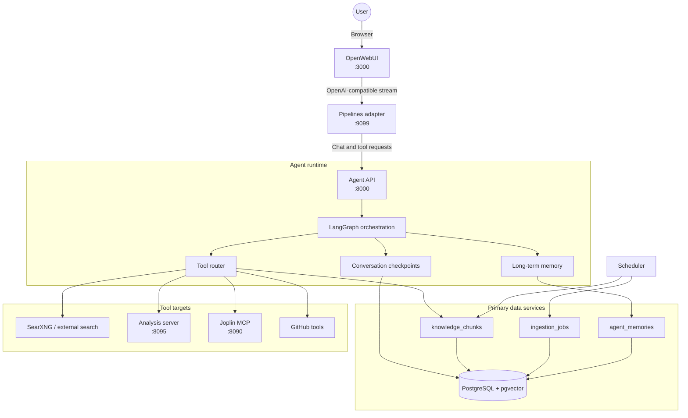

# Architecture

Parsnip is a local-first research and knowledge platform built around OpenWebUI,
a FastAPI/LangGraph agent runtime, PostgreSQL with pgvector, scheduled ingestion,
and optional analysis/Joplin integrations.

## High-Level Topology

OpenWebUI owns the browser experience. The Agent API owns orchestration,
retrieval, memory, tool execution, and model selection.

## Main Services

- `agent`: FastAPI service for retrieval, synthesis, memory, and tool workflows.
- `pipelines`: OpenWebUI-compatible adapter that forwards chat traffic to the agent.
- `analysis`: optional execution service for Python/R workloads and generated artifacts.
- `scheduler`: recurring ingestion, Joplin sync safety jobs, and backup jobs.
- `postgres`: primary store for vectors, memories, checkpoints, structured data, and Joplin's database.
- `joplin` / `joplin-mcp`: optional note server and integration bridge.
- `searxng`: local metasearch endpoint used when configured.

## Data Model Highlights

- `knowledge_chunks`: chunked source text, metadata, embeddings, and per-source identifiers.
- `agent_memories`: durable memory records used across sessions.
- `ingestion_jobs`: ingestion run state, progress, and resume tracking.
- LangGraph checkpoint tables: persisted conversation state.
- Structured tables such as `forex_rates` and `world_bank_data`.

## Ingestion Pattern

Ingestion pipelines follow a fetch/process split:

1. Fetch source payloads.
2. Persist raw landing artifacts where applicable.
3. Normalize, chunk, and embed records.
4. Upsert into structured/vector tables.
5. Record progress in `ingestion_jobs`.

This keeps source fetching separate from embedding and database writes, so failed
processing can be replayed without re-hitting upstream APIs.

## Model Routing and Backends

Concrete model IDs are deployment configuration, not code. The runtime resolves
stable aliases from `.env`:

- `FAST_MODEL`
- `SMART_MODEL`
- `REASONING_MODEL`
- `GRAPH_MODEL`
- `CLASSIFIER_MODEL`

Each alias can be a comma-separated fallback chain. `DEFAULT_LLM` and
`RESEARCH_LLM` may point at either explicit model IDs or aliases such as `smart`
and `reasoning`.

Supported backend modes:

- `LLM_PROVIDER=openrouter`: OpenRouter-hosted models.
- `LLM_PROVIDER=openai_compat`: any OpenAI-compatible endpoint.
- Ollama-compatible local/cloud endpoints through `OLLAMA_BASE_URL`,
  `OLLAMA_CLOUD_URL`, `OLLAMA_API_KEY`, and optional GPU routing variables.

Provider failover is explicit: sensitive workloads do not silently move to an
external provider unless that provider is configured in `.env`.

## Runtime Guardrails and Cost Control

- Adaptive tool budgets by complexity tier.
- Repeated-tool-call detection for identical arguments.
- Context pruning for oversized tool output and long message histories.
- LangGraph recursion caps to prevent runaway loops.
- Required model aliases validated at startup.

## Deployment Posture

- Docker Compose is the baseline for local and single-VM deployments.
- PostgreSQL data must live on block storage, not object storage.
- GCS is supported for backup artifacts and analysis outputs when configured.
- Managed PostgreSQL, VM/container hosts, and cloud object storage can be used by
  supplying the relevant `.env` values.

See `docs/ARCHITECTURE_VISUALS.md`, `docs/CONFIGURATION.md`, and
`docs/DEPLOYMENT.md` for operational diagrams and deployment detail.
