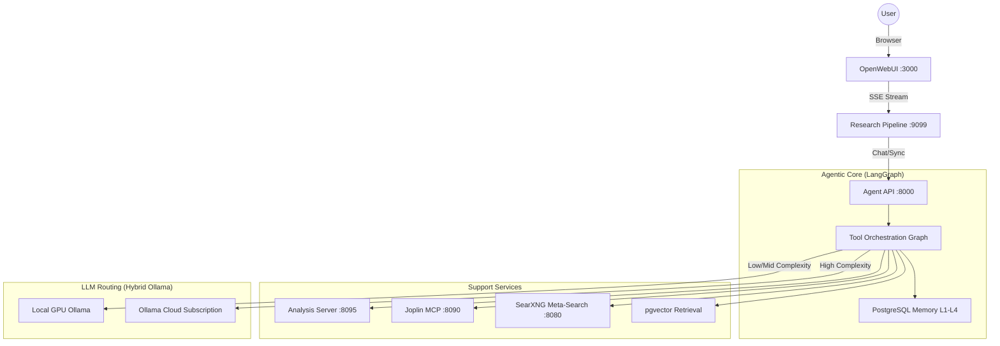

# Architecture

## High-Level Topology

## Main Services

- `agent`: tool-orchestrating API for retrieval, synthesis, and workflow execution.
- `pipelines`: OpenWebUI-compatible middleware for model/tool routing.
- `analysis`: optional execution runtime for Python/R workloads.
- `scheduler`: recurring ingestion and maintenance jobs.
- `postgres`: primary storage for vectors, memories, and ingestion metadata.
- `joplin-mcp`: optional integration bridge for note-based ingestion/output.

## Data Model Highlights

- `knowledge_chunks`: chunked content + embeddings for retrieval.
- `agent_memories`: durable memory records for cross-session context.
- `ingestion_jobs`: ingestion run state and progress tracking.

## Ingestion Pattern

Ingestion pipelines follow a fetch/process split:
1. Fetch source payloads.
2. Persist raw landing artifacts.
3. Transform/chunk/embed.
4. Upsert into structured/vector tables.

This allows replay on downstream failures without re-fetching upstream APIs.

## Model Routing and Backends

Runtime backend selection is hybrid and adaptive:
- **All-Ollama Stack (Preferred):** Hybrid local/cloud topology leveraging `OLLAMA_BASE_URL` (local GPU) for low/mid complexity tasks and `OLLAMA_CLOUD_URL` (subscription) for high-complexity reasoning (e.g., `kimi-k2.6:cloud`).
- `LLM_PROVIDER=openrouter`: Traditional per-token usage across 100+ models.
- `LLM_PROVIDER=openai_compat`: Custom OpenAI-compatible API endpoints.

## Agentic Guardrails & Cost Control

To ensure fiscal responsibility and prevent infinite tool loops:
- **Adaptive Tool Budgets:** Stricter limits based on task complexity (e.g., 25 calls for 'high' tier).
- **Loop Prevention:** Aggressive detection for repeated tool calls with identical arguments (limit: 2).
- **Context Pruning:** Automatic truncation of large tool outputs (>12k chars) and middle-history message dropping once sessions exceed 25 messages.
- **Graph Recursion Safety:** Capped at 50 nodes to prevent runaway reasoning cycles.

## Deployment Posture

- Local-first Docker Compose baseline.
- Provider-flexible deployment (VM, managed DB, cloud object storage optional).
- GCP can be productionized directly; AWS/Azure parity patterns documented in `docs/DEPLOYMENT.md`.
