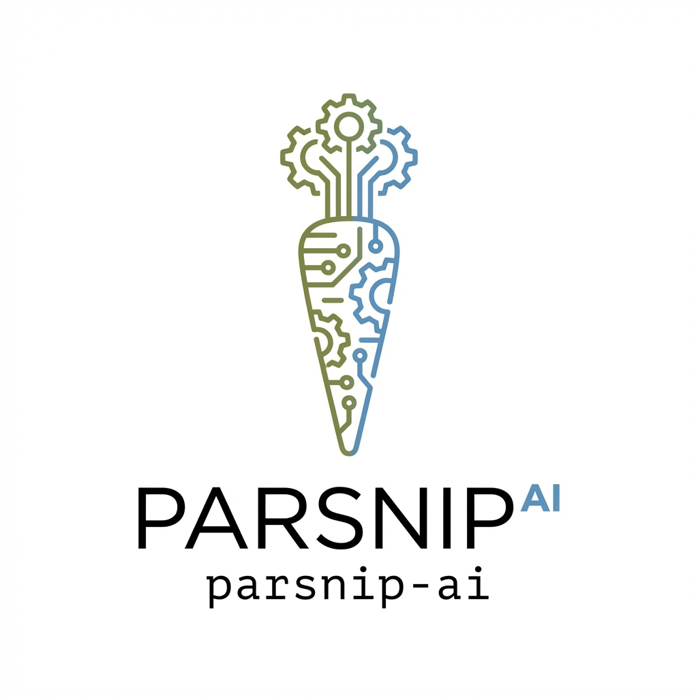

# parsnip-ai

<p align="center">
  
</p>

<p align="center">
  Open-source, self-hostable agentic research stack with grounded retrieval, memory, and notebook-grade analysis.
</p>

<p align="center">
  
  
  
  
  
  
  
  
</p>

## At A Glance

- Open-source agentic stack with grounded retrieval and memory.
- OpenWebUI frontend experience via the `:9099` research pipeline.
- Joplin notebook sync pipeline for practical end-user workflows.
- Configurable provider routing with local/remote endpoint support.
- Roadmap includes full multi-user support in the next major version.

## Quick Start

```bash
cp .env.example .env

# Build locally (dev / hacking)
docker compose up -d --build

# Or pull pre-built release images (faster)
IMAGE_TAG=0.1.0 docker compose up -d --no-build
```

Default endpoints:
- OpenWebUI: `http://localhost:3000`
- Pipelines: `http://localhost:9099`
- Agent API: `http://localhost:8000`
- Agent docs: `http://localhost:8000/docs`

## What It Is

`parsnip-ai` combines:
- a tool-using LangGraph agent backend,
- PostgreSQL/pgvector grounded retrieval and long-term memory,
- extensible ingestion for public and private knowledge sources,
- OpenWebUI + `:9099` pipelines routing,
- optional notebook-style chart/report execution (Python and R).

It is built for teams that want full control over models, data, and deployment.

## Why It’s Different

- Fully open source and self-hostable.
- Grounded generation via explicit ingestion and traceable sources.
- Agentic memory + retrieval in one cohesive stack.
- Pluggable data onboarding: APIs, notes, markdown, PDFs, and domain-specific connectors.
- **Hybrid RAG** — synthesizes live web search with curated knowledge base grounding (see below).
- Configurable model routing through `.env` (OpenRouter, OpenAI-compatible endpoints, local/remote Ollama embeddings).

## Hybrid RAG: Web + KB Synthesis

Unlike traditional RAG that only retrieves from a static corpus, `parsnip-ai` performs **live web search** and **knowledge base grounding** in the same request, then synthesizes cross-source reports with explicit provenance.

### Example: Space Exploration Report

**Prompt:** "Search the web for latest space news (2025-2026), then search the KB for Apollo/NASA history. Synthesize a grounded report."

**Output excerpt:**

> **Historical Context:** The Space Race was ignited by the Soviet Union's launch of *Sputnik 1* in 1957, leading to NASA's creation in 1958 **[Source: Apollo 11 KB]**.
>
> **Current Developments:** Artemis 1 tested uncrewed SLS/Orion; crewed missions face spacesuit/HLS delays **[Source: Web Search]**. In February 2026, SpaceX integrated xAI to accelerate AI-driven rocketry **[Source: SpaceX Updates]**.
>
> **Synthesis:** Apollo proved lunar travel was possible; Artemis now aims to make it sustainable, using public-private partnerships to establish long-term lunar presence **[Source: NASA News]**.

### Architecture

```
User Prompt
    |
    v
[Web Search]  --->  Real-time articles, news, papers (2025-2026)
    |                    |
    |                    v
[KB Search]   --->  Wikipedia grounding, historical context
    |                    |
    v                    v
[Synthesis Node]  --->  Markdown report with [Source: X] tags
    |
    v
[Joplin Export]  --->  Persistent note + joplin:// deep-link
```

### Try It Yourself

```bash
# Run the curated demo scenarios
python scripts/run_demo.py

# Or run a single scenario
python scripts/run_demo.py --scenario space_exploration
```

See [docs/HYBRID_RAG.md](docs/HYBRID_RAG.md) for the full capabilities showcase.

## Joplin Notebook Sync Pipeline

Parsnip includes an end-user friendly integration path:
- ingest personal or team notes into Joplin,
- sync through the Joplin pipeline,
- retrieve those notes in grounded responses and analysis workflows.

This gives non-technical users a practical notebook frontend while keeping ingestion and retrieval architecture consistent with the rest of the platform.

## Core Capabilities

- ReAct-style tool orchestration.
- Vector + FTS retrieval from `knowledge_chunks`.
- Structured data routes (e.g., World Bank/FX analysis workflows).
- Scheduled ingestion jobs (news, papers, notes).
- OpenWebUI-compatible chat via pipelines middleware.
- Optional analysis artifact generation (Python and R).

## Repository Layout

```text
agent/          Backend agent API + tool graph
analysis/       Analysis execution server
ingestion/      Source ingestion scripts/pipelines
scheduler/      Scheduled ingestion orchestration
joplin-mcp/     Joplin bridge service
db/             Database schema/init
pipelines/      OpenWebUI pipelines connector
docs/           Deployment, extension, and roadmap docs
```

## Configuration

Runtime behavior is `.env`-driven:
- `LLM_PROVIDER=openrouter|openai_compat`
- OpenRouter keys/models or OpenAI-compatible base URL + API key
- `OLLAMA_BASE_URL` for local or remote embeddings

See [docs/CONFIGURATION.md](docs/CONFIGURATION.md).

## Docs

- Deployment: [docs/DEPLOYMENT.md](docs/DEPLOYMENT.md)
- Configuration: [docs/CONFIGURATION.md](docs/CONFIGURATION.md)
- Extension guide: [docs/EXTENDING.md](docs/EXTENDING.md)
- Roadmap (including multi-user support): [docs/ROADMAP.md](docs/ROADMAP.md)
- Branding assets: [docs/branding/README.md](docs/branding/README.md)
- Architecture: [ARCHITECTURE.md](ARCHITECTURE.md)
- Security: [SECURITY.md](SECURITY.md)

## License

Apache License 2.0. See [LICENSE](LICENSE).
