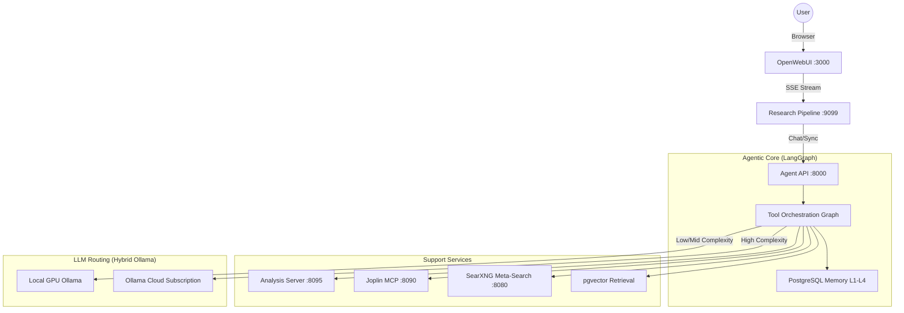
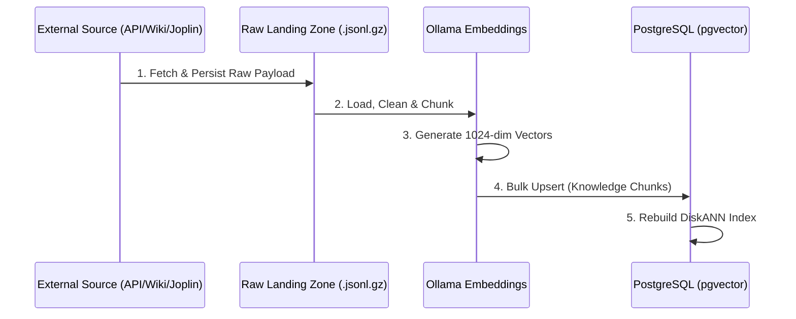
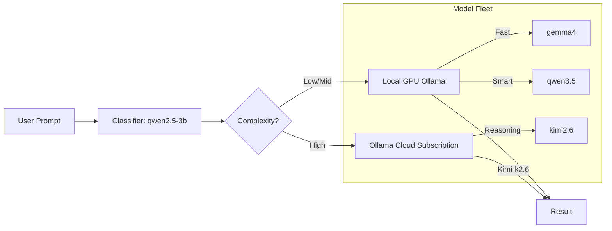
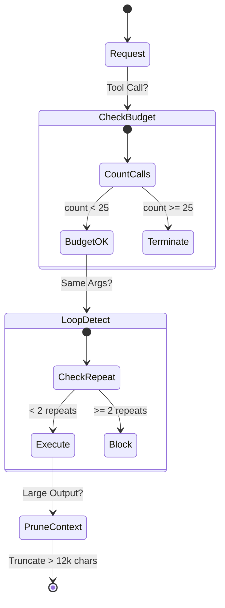

# Architectural Visualizations

## 1. High-Level System Topology
This diagram shows the request flow from the user through the agentic layers to the supporting services.

## 2. Ingestion Pipeline Pattern
The "Fetch-First" pattern ensures that raw data is never lost and embeddings can be re-run without re-hitting external APIs.

## 3. Hybrid Model Routing Logic
The agent autonomously determines where to route tasks based on complexity tiers defined in `config.py`.

## 4. Cost Control & Guardrails
Visualizing the loop prevention and context pruning logic that maintains stability.

