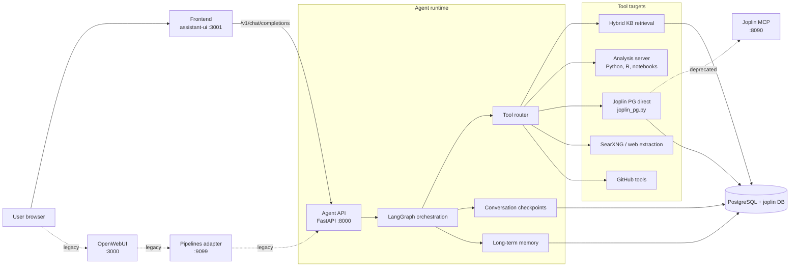
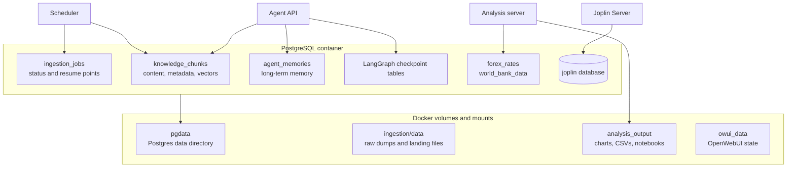
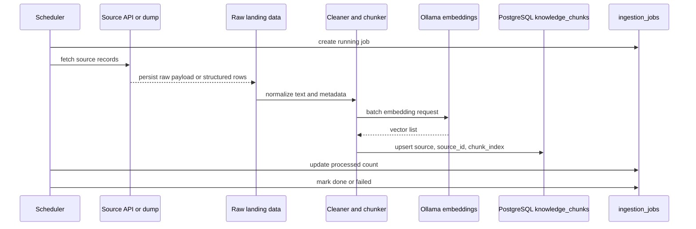
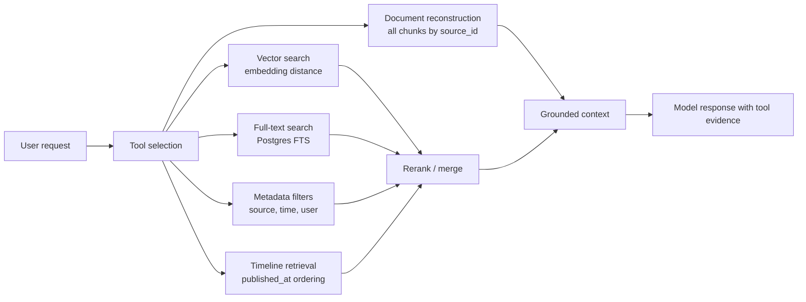
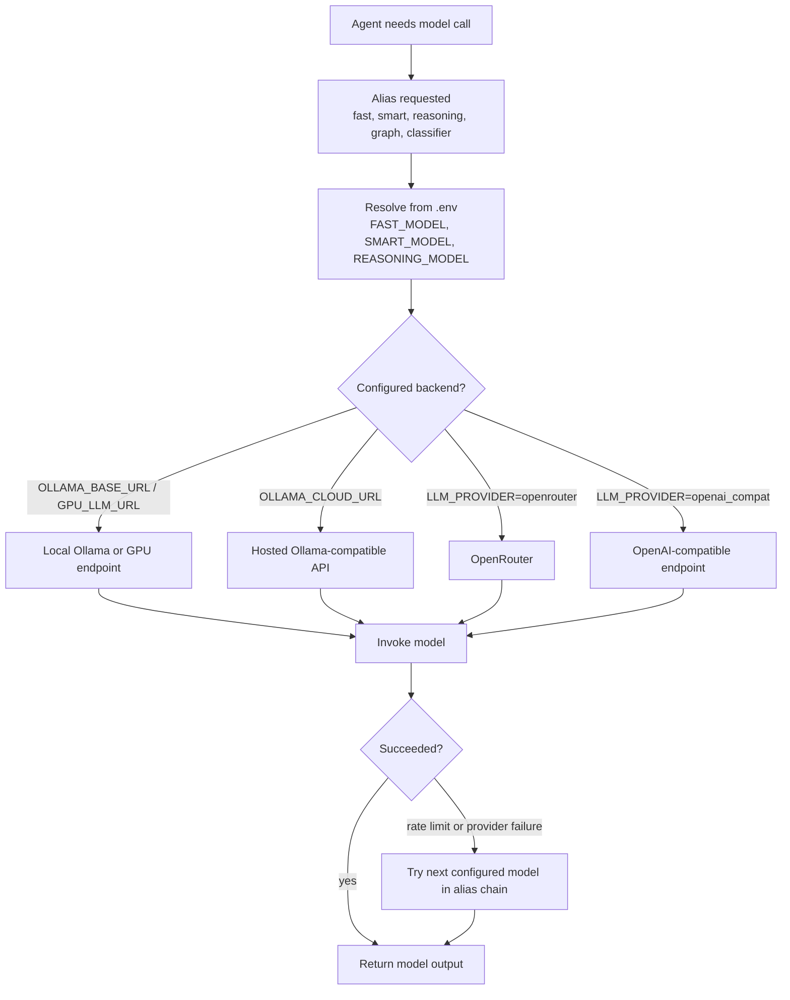
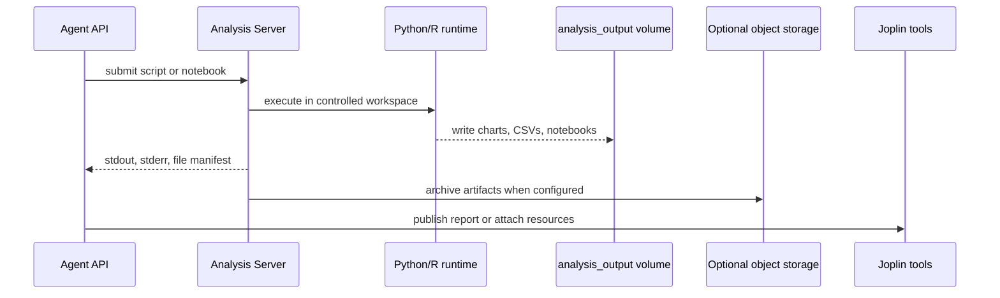
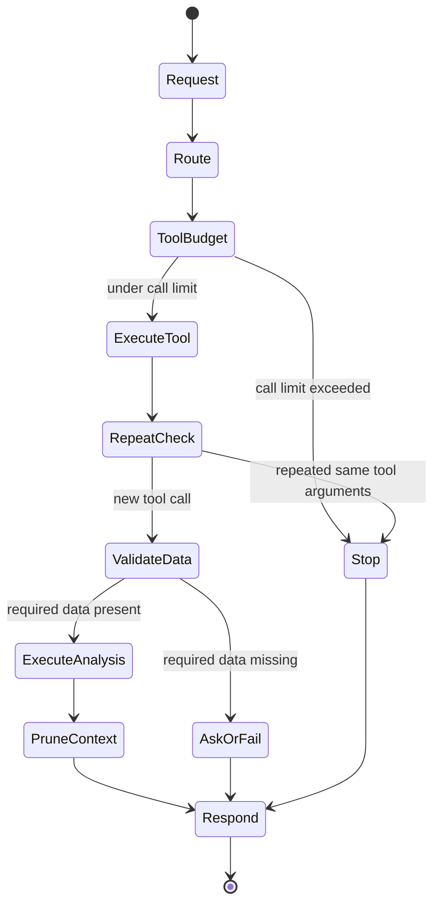

# Architecture Visuals

This document describes the main runtime paths in `parsnip-ai`: user requests, retrieval, ingestion, model routing, analysis execution, and backup. The diagrams are intended for operators and contributors who need to understand service boundaries before changing deployment or data flow behavior.

## 1. Runtime Request Path

A chat request enters through the **assistant-ui** frontend (Next.js/React) using
`/v1/chat/completions`, is handled by the Agent API. The agent decides whether to answer from memory, retrieve from the knowledge base, call external tools, execute analysis code, or publish a result to Joplin.

`OpenWebUI` and its pipeline adapter remain available for backward compatibility.



Key boundary: The **frontend** (assistant-ui) owns the browser experience, but the Agent API owns orchestration, memory, retrieval, and tool execution. The Joplin MCP HTTP bridge is deprecated; the agent connects directly via the `joplin` connection pool.

## 2. Durable Storage Layout

PostgreSQL is the main system of record for the agent. Joplin has a separate database because it is an application with its own schema and sync semantics. Analysis outputs are files, not chat messages, and are served through the analysis service.



Operational note: database volumes must remain on block storage. Object storage is used for backup artifacts, not as a live database filesystem.

## 3. Ingestion and Embedding Flow

Ingestion jobs fetch source data, preserve enough raw or structured input to make the process reproducible, then create chunks and embeddings. The same table is used across text sources, with source-specific metadata kept in JSONB.



The stable identity for a text chunk is `(source, source_id, chunk_index)`. For Wikipedia, `source_id` is the article title and `chunk_index` is the chunk number within that article.

## 4. Retrieval Paths

The agent can use multiple retrieval tools depending on the prompt. Simple questions may use a direct KB search; broader research prompts can combine vector search, full-text search, time filtering, source comparison, and document reconstruction.



Retrieval tools should preserve source identifiers in their output so the response can be traced back to the underlying records.

## 5. Model Routing and Fallbacks

The agent resolves stable aliases such as `fast`, `smart`, and `reasoning` into concrete provider IDs from `.env`. Local models are useful for private or low-latency work; cloud or OpenAI-compatible models can be used for larger synthesis tasks when explicitly configured.



Fallback behavior should stay explicit. A model failure should not silently route sensitive workloads to an external provider unless that provider is configured.

## 6. Analysis Execution and Artifact Handling

Analysis code runs outside the agent process. The agent sends scripts or notebooks to the analysis server, which executes them, captures logs and files, and returns links or summaries to the agent.



Generated artifacts are operational data. They should be backed up or retained according to the same policy as notebook outputs and user documents.

## 7. Backup and Recovery Flow

The backup system uses a layered defense-in-depth approach: physical (pgBackRest), logical (Parquet), config, and volume-level.

### 7.1 Backup Architecture

```mermaid
flowchart TB
    subgraph Scheduler[Scheduler Service]
        S1[Hourly incremental<br/>backup_kb.py]
        S2[Weekly full<br/>backup_kb.py --mode full]
        S3[Daily config<br/>backup_config.py]
        S4[Daily volume sync<br/>sync_volumes.py]
        S5[pgBackRest<br/>weekly full / daily diff / 5-min WAL]
    end

    subgraph Sources
        PG[(PostgreSQL<br/>agent_kb + joplin)]
        Vol[Docker volumes<br/>analysis_output<br/>owui_data<br/>pipelines_data]
        Proj[Project files<br/>configs + code]
    end

    subgraph GCS[(Google Cloud Storage)]
        PGRepo[pgBackRest repo<br/>full + diff + WAL]
        Parquet[Parquet partitions<br/>_manifest.json]
        Config[config.tar.gz<br/>secrets.tar.gz.age<br/>volume_manifest.json]
        VolSync[Volume snapshots<br/>rsync with md5 dedup]
    end

    PG --> S5 --> PGRepo
    PG --> S1 --> Parquet
    PG --> S2 --> Parquet
    Proj --> S3 --> Config
    Vol --> S4 --> VolSync
```

### 7.2 Restore Flow

A restore orchestrator (`restore_stack.sh`) performs 6 phases:
1. Pull config + decrypt secrets
2. Start postgres container and wait for health
3. pgBackRest restore (optionally to a target time)
4. Start remaining stack services
5. Rsync volumes from GCS
6. Verify: row counts, sample content byte-equality, embedding cosine similarity >=0.9999

For PITR, specify `--at "YYYY-MM-DD HH:MM"`.  For sandbox testing, use `--target sandbox`.

### 7.3 Retention

| Backup Type | Retention | Rotation |
|-------------|-----------|----------|
| pgBackRest full | 4 weeks | Weekly Sunday 03:00 UTC |
| pgBackRest diff | 7 days | Daily |
| WAL archives | 7 days | Real-time (5-min archive_timeout) |
| Parquet full | 4 weeks | Weekly Sunday 02:30 UTC |
| Parquet incremental | 7 days | Hourly |
| Config | 30 days | Daily |
| Volume sync | 7 days | Daily |

> **Warning:** Backups are snapshot artifacts. They are not replacements for the live database volume. Recovery should be tested from backup artifacts before relying on them for production operations.

## 8. Guardrails

Runtime guardrails protect the operator from runaway loops, oversized context, missing required data, and unsafe analysis assumptions.


