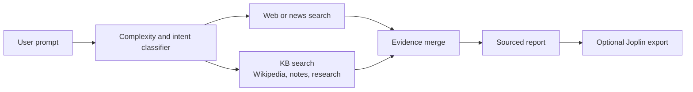

# Hybrid Retrieval Workflows

This document describes the platform's hybrid retrieval pattern: combine current
web or API results with local knowledge-base context, then produce a sourced
answer or analysis artifact.

## Retrieval Pattern

1. **Classify the request** by complexity and intent.
2. **Fetch current context** through web search or live APIs when freshness is
   required.
3. **Search the local KB** for background, prior notes, source documents, and
   structured context.
4. **Merge evidence** while preserving source identifiers.
5. **Synthesize the answer** with citations, caveats, and optional analysis
   artifacts.

The exact KB size changes as ingestion jobs run, so examples should avoid fixed
record counts unless they are generated from a fresh `kb_report.py` run.

## Example: Current Topic With Historical Context

Prompt:

```text
Search for recent lunar exploration developments, then use the local KB for
Apollo and NASA background. Produce a short report connecting current activity
to historical context.
```

Expected tool path:



Expected output structure:

- Current developments with source links.
- Historical context from local KB records.
- Comparison of what changed and what stayed constant.
- Clear separation between live web findings and local KB evidence.

## Example: Research Synthesis

Prompt:

```text
Find recent papers about retrieval-augmented generation evaluation, compare them
with established local notes, and identify practical implications for this
stack.
```

Expected tool path:

- `adaptive_search` for current web/research context.
- `kb_search` or `holistic_search` for local papers, notes, and Wikipedia.
- `compare_sources` when the answer needs explicit disagreement or coverage
  analysis.
- `save_memory` only when the user asks to preserve a durable project fact.

## Provenance Expectations

Responses should keep evidence traceable:

- Preserve URLs for web results.
- Preserve `source`, `source_id`, and `chunk_index` for KB records.
- Mark uncertainty when a live result is unavailable or stale.
- Prefer source comparison over unsupported synthesis when sources conflict.

## Related Components

- `agent/tools/adaptive_search.py`
- `agent/tools/holistic_search.py`
- `agent/tools/kb_search.py`
- `agent/tools/compare_sources.py`
- `agent/tools/timeline.py`
- `agent/tools/joplin.py`
