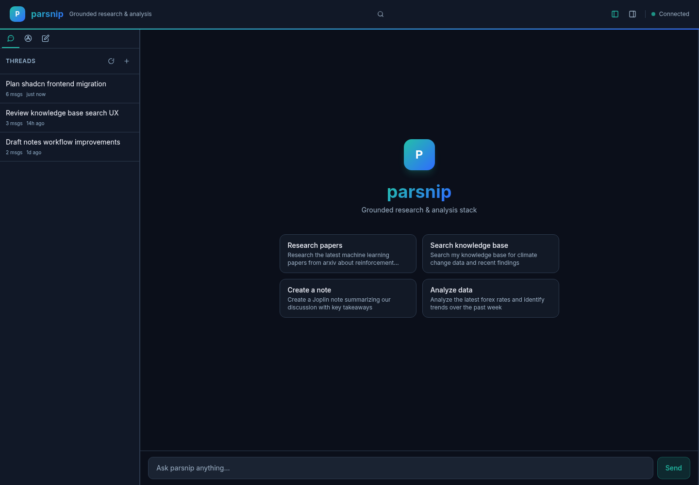
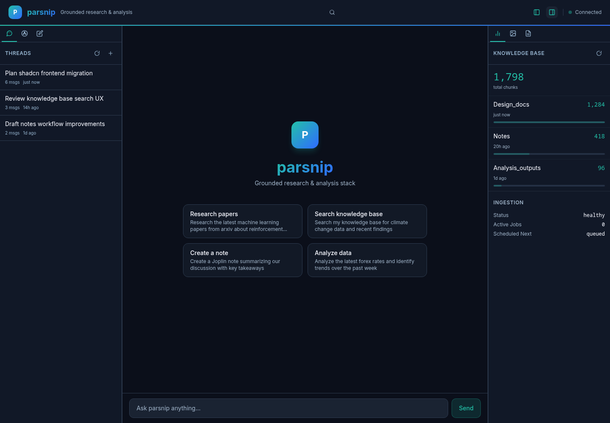
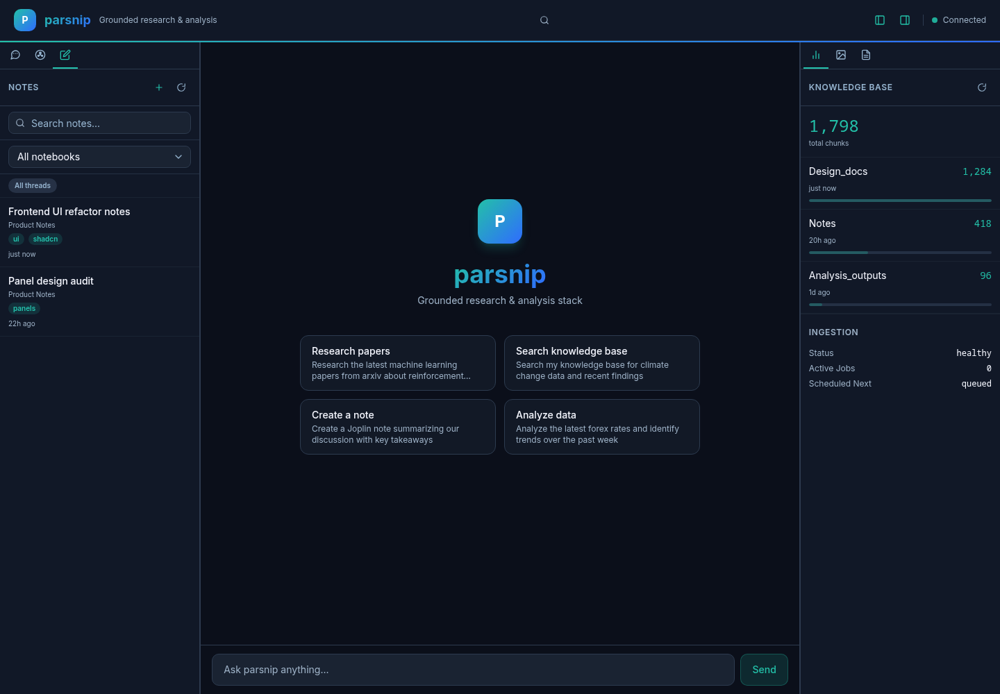
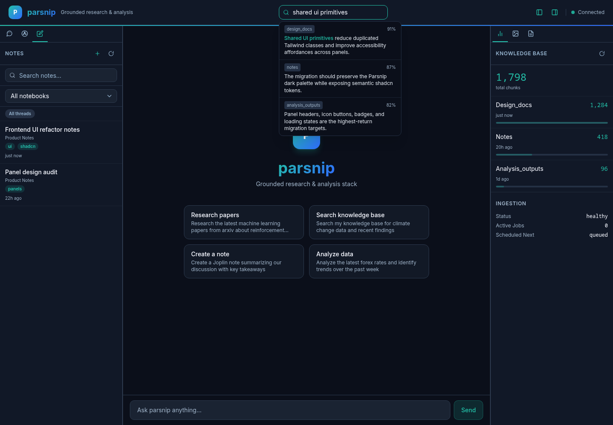

# Frontend shadcn/ui refactor

_Date captured: 2026-04-25_

This document summarizes the frontend UI refactor that introduced shadcn-style primitives into Parsnip and replaced several repeated homebrewed Tailwind patterns with shared components.

The screenshots below were captured with Playwright against the local Next.js dev server. API responses were mocked during capture so the images are deterministic and do not include private local thread/note data.

## Screenshots

| View | Screenshot |
| --- | --- |
| Main app shell with migrated sidebar tabs, panel header controls, composer, and semantic theme tokens |  |
| Right sidebar KB stats using shared panel header controls and preserved Parsnip theme |  |
| Notes sidebar with shadcn-style input, native select, badges, and shared icon buttons |  |
| Header KB search widget expanded alongside notes and stats panels |  |

## What changed

### shadcn foundation

- Added `frontend/components.json` for shadcn-compatible component configuration.
- Added `frontend/src/lib/utils.ts` with the standard `cn()` helper built from `clsx` and `tailwind-merge`.
- Added shadcn-style primitives under `frontend/src/components/ui/`, including:
  - `button`
  - `input`
  - `textarea`
  - `card`
  - `badge`
  - `skeleton`
  - `tabs`
  - `tooltip`
  - `resizable`
  - `select` / `native-select`
  - `dialog` / `alert-dialog`
  - `scroll-area`, `separator`, `spinner`, `empty`, `collapsible`

### Theme tokens

- Added shadcn semantic tokens to `frontend/src/app/globals.css`, mapped to the existing Parsnip dark palette.
- Extended `frontend/tailwind.config.ts` with semantic color names:
  - `background`
  - `foreground`
  - `card`
  - `popover`
  - `primary`
  - `secondary`
  - `muted`
  - `accent`
  - `destructive`
  - `border`, `input`, `ring`
- Kept the existing `--parsnip-*` variables for assistant-ui overrides, TipTap styling, markdown rendering, and brand-specific utilities.

### Refactored UI patterns

- Migrated app-level tooltip support by wrapping the layout in `TooltipProvider`.
- Replaced repeated raw button/header patterns with shared panel primitives:
  - `PanelHeader`
  - `PanelTitle`
  - `PanelActions`
  - `PanelIconButton`
- Refactored reusable local wrappers:
  - `EmptyState` now uses the shadcn-style `Empty` family and `Button`.
  - `ErrorBanner` now uses semantic destructive styling and `Button`.
  - `LoadingSkeleton` now uses the shared `Skeleton` primitive.
- Migrated the main shell from direct `react-resizable-panels` usage to shadcn-style `ResizablePanelGroup`, `ResizablePanel`, and `ResizableHandle` wrappers.
- Migrated sidebar tab chrome to shared `Tabs` primitives.
- Migrated note editor controls to shared `Button` and `Textarea` primitives.
- Migrated approval and tool-boundary surfaces toward shared `Card` and `Button` primitives.

### Frontend organization updates included in the same history update

The shadcn work landed together with the existing frontend reorganization because the files overlapped substantially:

- Added the header KB search widget.
- Moved KB search out of the left sidebar flow.
- Added center-panel note editing support.
- Added raw/rich note editing toggle.
- Added thread-context chips for notes and outputs.
- Updated the agent tool preference to favor `holistic_search` over direct `kb_search` exposure.

## Anti-patterns addressed

- **Repeated Tailwind class strings:** common button, badge, input, empty, skeleton, and panel-header styles now flow through shared primitives.
- **Low-level primitives leaking into app code:** the app shell now uses local shadcn-style resizable wrappers rather than importing all resizable pieces directly.
- **Icon-only buttons with inconsistent behavior:** panel actions now use a shared icon button wrapper with tooltip support and accessible labels.
- **Theme drift risk:** semantic tokens centralize the bridge between shadcn component expectations and the Parsnip brand palette.
- **Tailwind v4 class leakage:** generated component classes were normalized to Tailwind 3-compatible patterns because this frontend is still on Tailwind 3.4.

## Validation

The frontend build passes:

```bash
cd frontend && npm run build
```

Screenshots were captured with Playwright using a local dev server:

```bash
cd frontend && npm run dev
# in another shell, run the Playwright capture script used for this document
```

## Follow-up opportunities

- Continue migrating `ToolUIs.tsx` into small shared pieces such as `ToolCard`, `ToolHeader`, `ToolStatusBadge`, and `ToolResultBlock`.
- Move remaining inline SVG icons to `lucide-react` for consistency.
- Consider visual regression tests around the four captured states.
- Add Storybook or a lightweight component gallery for the shared UI primitives if the design system continues to grow.
